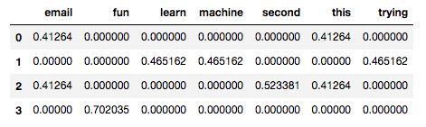
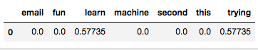

# Training a Naive Bayes model to identify the author of an email or document

In this example, we use a set of emails or documents that were written by two different individuals. The purpose is to train a Naive Bayes model to be able to predict who wrote a document/email, given the words used in it.

The Github repository with the files used in this example can be found [here](https://github.com/duranivan). The file `nb_email_author.py` contains the script that loads the data, trains the model, and find the score of the prediction for train and test sets.

Here, we explain the main parts of the script and the results.


## Loading the data

The first section of the script loads the data. The only particularity here is that 'pickle' is used deserialize the original data file (for more on pickle and serialization/deserialization, take a look at this [link](https://docs.python.org/3/library/pickle.html)).

Two files are loaded, one that contains the emails or documents, and another one with just the emails' authors. Once we deserialize and load the files, we have two arrays (lists), one named `words`, and one named `authors`, each of size 17,578. Each element in `words` is a single string that contains an email or document. Each element in `authors` is either 0 or 1.

As usual, we split the data into train and test sets using the Scikit-learn method `sklearn.model_selection.train_test_split`. 

```python
from sklearn.model_selection import train_test_split

features_train, features_test, labels_train, labels_test = train_test_split(
    words, authors, test_size=0.1, random_state=10)
```


## Text vectorization

When dealing with texts in machine learning, it is quite common to transform the text into data that can be easily analyzed and quantify.

For this, the most commonly used technique is the **tf-idf** short for "term frequency-inverse document frequency", which basically reflects how important a word is to a document (email) in a collection or corpus (our set of emails or documents).

The tf-idf is an statistic that increases with the number of times a word appears in the document, penalized by the number of documents in the corpus that contain the word ([Wikipedia](https://en.wikipedia.org/wiki/Tf%E2%80%93idf)).

Fortunately for us, Scikit-learn has a method that does just this (`sklearn.feature_extraction.text.TfidfVectorizer`). See the documentation [here](http://scikit-learn.org/stable/modules/generated/sklearn.feature_extraction.text.TfidfVectorizer.html).

So we apply this method to our data in the following way:

```python
from sklearn.feature_extraction.text import TfidfVectorizer

vectorizer = TfidfVectorizer(sublinear_tf=True, max_df=0.5,
                             stop_words='english')
features_train = vectorizer.fit_transform(features_train)
features_test = vectorizer.transform(features_test)
```

`TfidfVectorizer` sets the vectorizer up. Here we change `sublinear_tf` to true, which replaces $tf$ with $1 + \log(tf)$. This addresses the issue that "twenty occurrences of a term in a document" does not represent "twenty times the significance of a single occurrence" ([link](https://nlp.stanford.edu/IR-book/html/htmledition/sublinear-tf-scaling-1.html)). Therefore, it reduces the importance of high frequency words (note that $1+log(1) = 1$, $1+log(20) = 2.3$).

Additionally, `stop_words` is set to 'english', so stop words such as "and", "the", "him" will be ignored in this case, and `max_df=0.5` means that we are ignoring terms that have a document frequency higher than 0.5 (i.e., the proportion of documents in which the term is found).

Next, we fit and transform the features (terms or words in our case) for both train and test sets. Notice that for the train set we use `fit_transform`, and for the test set we use just `transform`.

This makes sense since we want the model to learn the vocabulary and the document frequencies by the train set, and then transform the train features into a terms-document matrix. For the test set we just want to use the learned document frequencies (idf's) and vocabulary to transform it into a term-document matrix.

**Let's see how this look like with a simplified example**:

Suppose we have the following train corpus, again, each item represents one document/email:

```python
corpus = [
    'This is my first email.',
    "I'm trying to learn machine learning.",
    "This is the second email",
    "Learning is fun"
]
```

Now, let's fit and transform it:

```python
vectorizer = TfidfVectorizer()
X = vectorizer.fit_transform(corpus)
print(X.__str__)
# <4x13 sparse matrix of type '<class 'numpy.float64'>' with 18 stored elements in Compressed Sparse Row format>
```

`fit_transform` returns a sparse matrix:

```python
print(X)
# (0, 10)	0.41263976171812644
# (0, 3)	0.3340674500232949
# (0, 7)	0.5233812152405496
# (0, 1)	0.5233812152405496
# (0, 0)	0.41263976171812644
# (1, 12)	0.4651619335222394
# (1, 11)	0.4651619335222394
# (1, 4)	0.4651619335222394
# (1, 6)	0.4651619335222394
# (1, 5)	0.3667390112974172
# (2, 10)	0.41263976171812644
# (2, 3)	0.3340674500232949
# (2, 0)	0.41263976171812644
# (2, 9)	0.5233812152405496
# (2, 8)	0.5233812152405496
# (3, 3)	0.4480997313625986
# (3, 5)	0.5534923152870045
# (3, 2)	0.7020348194149619
```

If we transform `X` into a 2D array, it looks like this (there are 13 columns in total, each represent a word/term, odd columns are omitted for brevity):

```python
vocabulary = vectorizer.get_feature_names()
pd.DataFrame(data=X.toarray(), columns=vocabulary).iloc[:,0::2]
```



```python
print(vocabulary)
# ['email', 'first', 'fun', 'is', 'learn', 'learning', 'machine', 'my', 'second', 'the', 'this', 'to', 'trying']
```

Now let's suppose that we have the following 'test' document:

```python
test = ["I'm also trying to learn python"]
```

Let's transform it and take a look at it:

```python
X_test = vectorizer.transform(test)
pd.DataFrame(data=X_test.toarray(), columns=vocabulary).iloc[:, 0::2]
```




There you have it, this is how texts or documents are vectorized for further analysis.


## Training a Naive Bayes model

For this example, we use a Gaussian Naive Bayes (NB) implementation (Scikit-learn documentation [here](http://scikit-learn.org/stable/modules/generated/sklearn.naive_bayes.GaussianNB.html#sklearn.naive_bayes.GaussianNB)). In future articles, we will discuss in detail the theory behind Naive Bayes.

For now, it is worth saying that NB is based on applying the Bayes' rule to calculate the probability or likelihood that a set of words (document/email) is written by someone or some class (e.g. $P(``Chris"|``learn", ``machine", ``trying",...)$).

However, there is no such a thing as a naive Bayes' rule. The 'naive' term arises due to assuming that features are independent from each other (conditional independence), which means, for our emails analysis, that we are assuming that the location of words in a sentence is completely random (i.e. 'am' or 'robot' are equally likely to follow the word 'I', which of course is not true).

### NB with Scikit-learn

In general, training machine learning models with Scikit-learn is straightforward and it normally follows the same pattern:

- initialize an instance of the class model,
- fit the train data,
- predict the test data (we omit that here),
- compute scores for both train and test sets. 

```python
from sklearn.naive_bayes import GaussianNB
from time import time

t0 = time()
model = GaussianNB()
model.fit(features_train, labels_train)
print(f"\nTraining time: {round(time()-t0, 3)}s")
t0 = time()
score_train = model.score(features_train, labels_train)
print(f"Prediction time (train): {round(time()-t0, 3)}s")
t0 = time()
score_test = model.score(features_test, labels_test)
print(f"Prediction time (test): {round(time()-t0, 3)}s")

print("\nTrain set score:", score_train)
print("Test set score:", score_test)
```

The results are the following:

```
>>> Training time: 1.601s
>>> Prediction time (train): 1.787s
>>> Prediction time (test): 0.151s

>>> Train set score: 0.9785082174462706
>>> Test set score: 0.9783845278725825
```

Not bad!